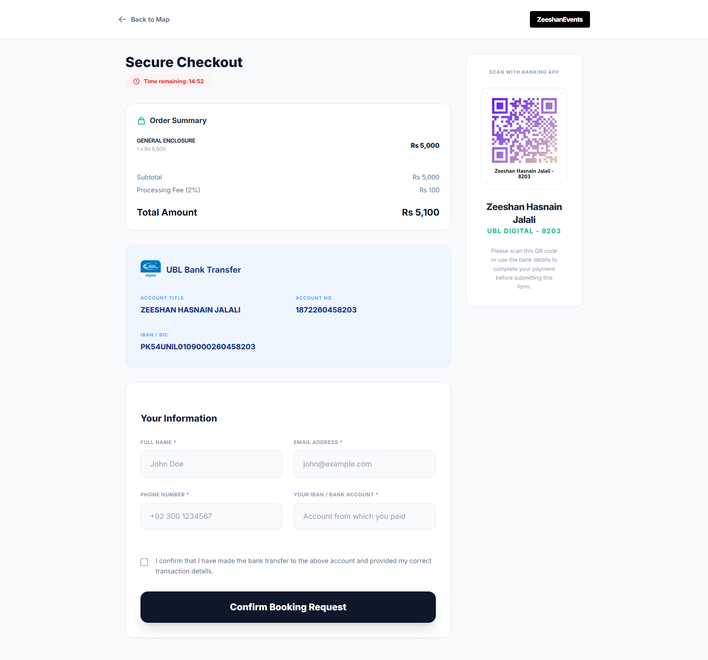
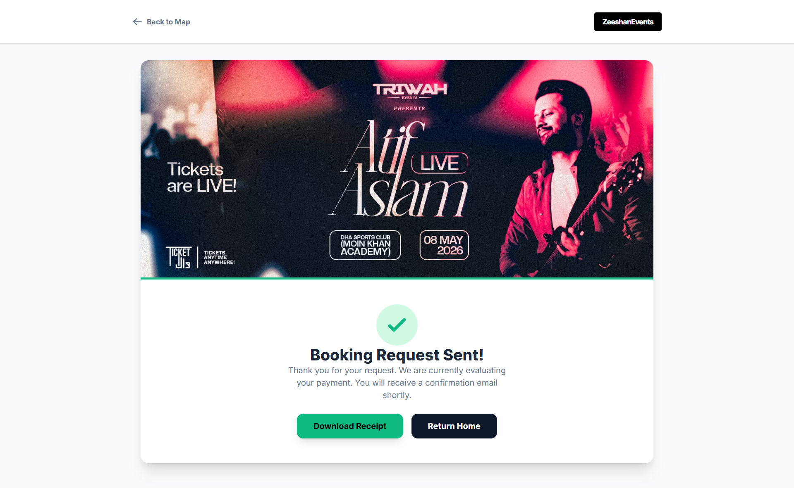
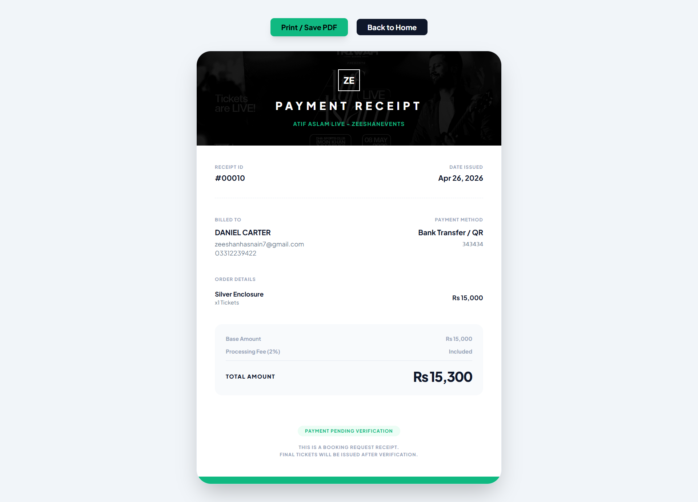
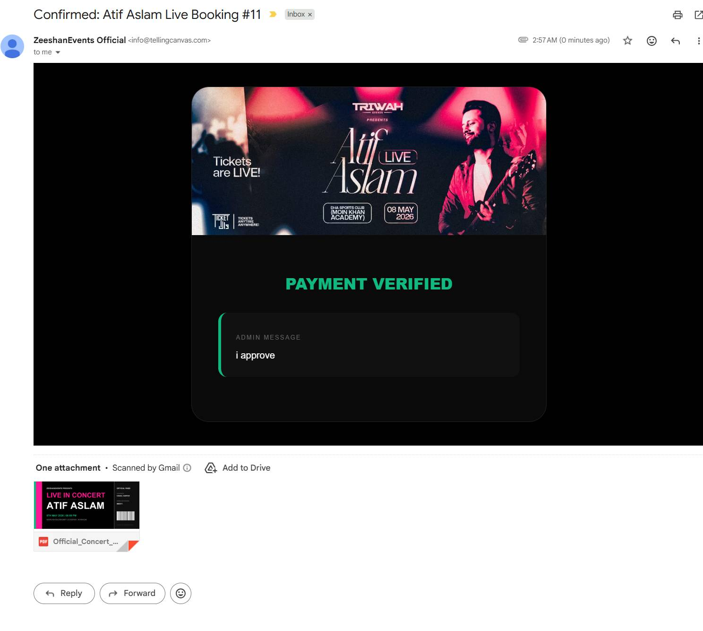
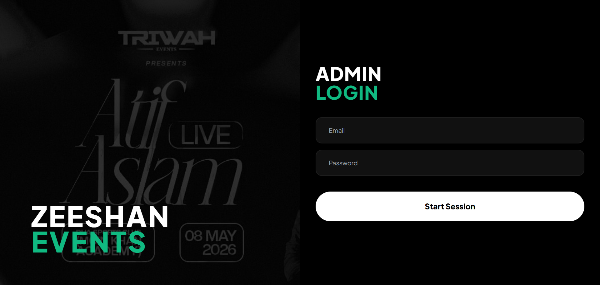
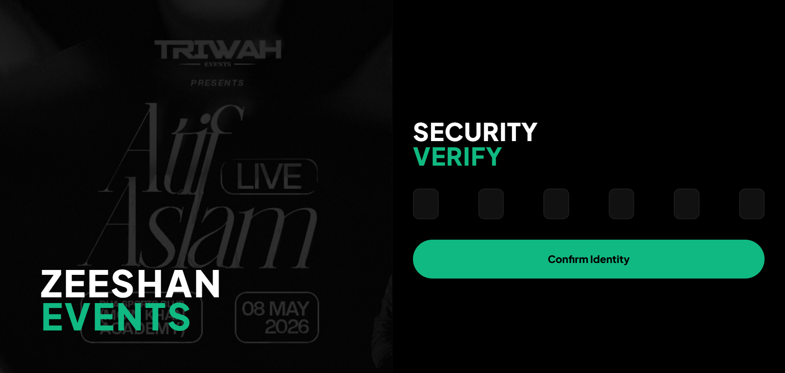
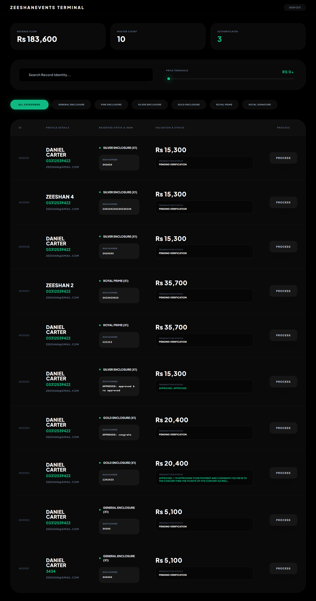
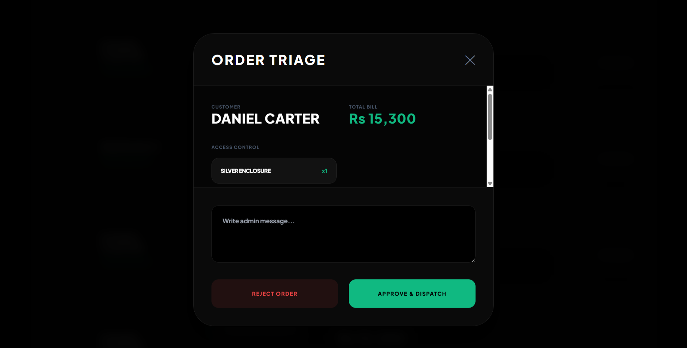

<<<<<<< HEAD

## 🚀 Overview

This project was inspired by a real-world observation. While browsing a ticketing website, ticketwala.pk, for an Atif Aslam concert, I noticed a major usability gap. The seating map was completely static and offered no interaction. Users could see the layout, but they could not hover over different enclosures, understand pricing visually, or select tickets directly from the map. This created a disconnect between what users see and how they actually book tickets. That gap triggered both curiosity and frustration, and I decided to rebuild the entire experience from scratch as a personal project.

What started as an attempt to make the seating map interactive quickly evolved into a complete end to end ticketing system. I implemented a dynamic seating interface where each enclosure is traced using its actual shape, allowing users to hover over sections and select tickets directly from the venue map with real time quantity and pricing updates. Alongside the frontend experience, I developed a full backend system using PHP and SQLite to handle order processing, customer data, and ticket management.

The system includes a complete checkout flow with OTP based verification to ensure valid user submissions. After checkout, users receive a payment confirmation email along with generated PDF tickets. A receipt system is also included, allowing users to download their receipt and use it as a reference for their order when contacting support. On the administrative side, I built a secure admin dashboard with OTP login, where all customer entries and orders can be managed. The admin can review submitted payments, approve or reject them through a popup interface, and control the entire order lifecycle from submission to confirmation.

This project goes beyond improving the user interface and focuses on solving both user experience and operational challenges in event ticketing. It brings together interactive design, backend processing, payment validation, email automation, and admin level control into one cohesive system.

The live deployment of this project can be found at:  
[https://atifaslam.tellingcanvas.com](https://atifaslam.tellingcanvas.com)

## 📸 Screenshots

### Landing Page

### Checkout Page

### Success Page

### Receipt

### Payment Confirmation Email

### Admin Login

### Admin OTP

### Admin Dashboard

### Payment Approval Popup

=======
# atifaslam
Here is a punchy, 350-character version for a quick LinkedIn update:  I cloned the Ticket Wala site to build a better, more interactive version. Using PHP and SQLite, I created ZeeshanEvents Terminal, featuring an interactive seating map, a secure Admin portal with 2FA OTP, and automated PDF ticket dispatch via email. A hobby project.
>>>>>>> c3fafbe0e346e2551e410e52f56986e6c5bc0c7b
